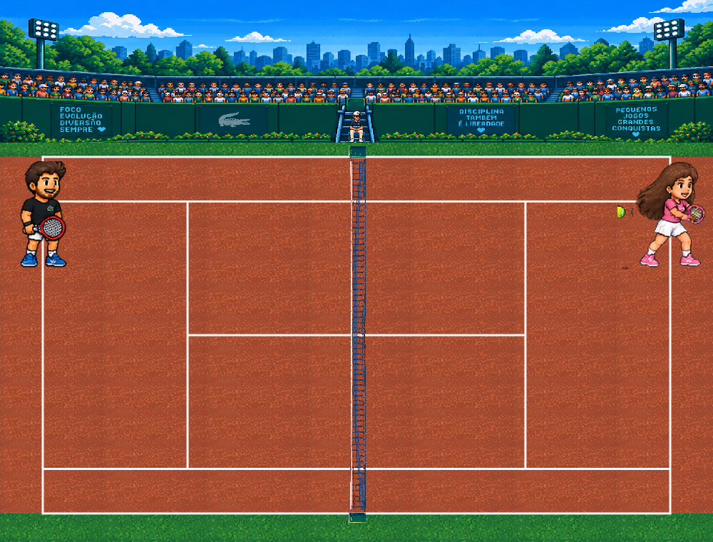
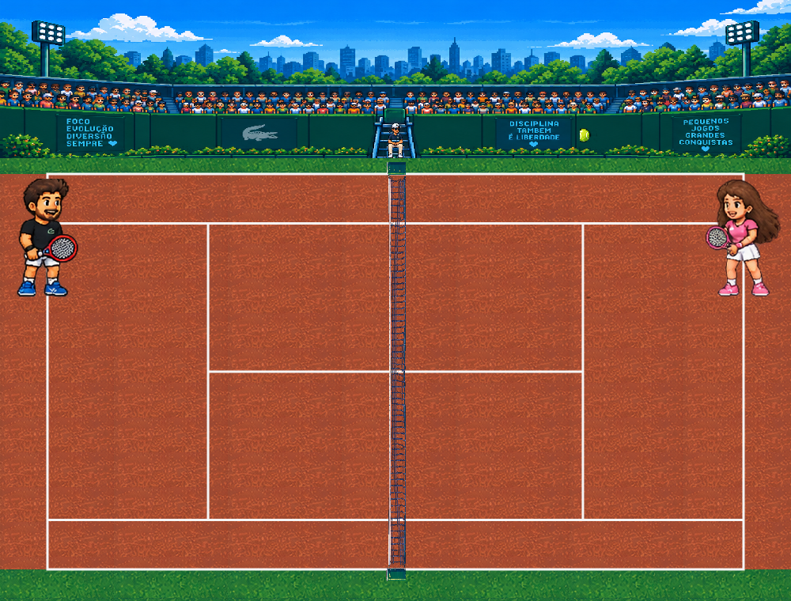

# Tênis da Vida

A 2D pixel-art tennis game built from scratch with TypeScript and the HTML5 Canvas — arcade physics, a real deterministic rally, a manual two-step serve for the player, an automatic CPU opponent serve, and traditional tennis scoring, all covered by an automated test suite.



## Live demo

Not deployed yet — runs locally (see [Running locally](#running-locally)). This section will be updated with a live link once the project is deployed.

## About

Leo and Alice play out a full tennis match — serve, rally, score — rendered as pixel art on a 2D canvas, viewed from the side (the net is vertical on screen, not horizontal). The project's goal was to build a genuinely playable arcade tennis game, not a tech demo: real ball physics (gravity, bounce, arc), a CPU opponent with difficulty-tuned prediction and error, and a scoring system that follows real tennis rules (0/15/30/40, deuce/advantage, games, sets), all driven by a framework-agnostic simulation core that's fully unit-tested independent of rendering.

## Features

- Playable rally: timing- and position-based hit detection, lateral aiming (hold A/D on contact), increasing ball speed as a rally goes on
- Manual two-step serve for the player: toss, then a timed contact window (PERFECT / GOOD / fault), with A/D aiming
- Automatic, deterministic serve for the CPU opponent — no keyboard dependency, no randomness in her timing
- Deterministic CPU opponent: real trajectory prediction, per-difficulty position error and hit error (Easy / Normal / Hard / Insane)
- Traditional tennis scoring — points, games (deuce/advantage), sets, full match — with correct server alternation and serve-side (deuce/ad court) alternation
- Arcade projectile physics — gravity, bounce, arc — shared identically between rallies and serves (no duplicated physics)
- Sprite-based character animation (idle / prepare / contact / recover / miss) for both players, synced to real engine events rather than a decorative timer
- Real pixel-art court, drawn from a single geometric source of truth (not baked into a static image)
- HUD with live score, rally counter, and per-shot PERFECT/GOOD/MISS feedback

## Architecture

```text
Input (keyboard)
      ↓
Game Engine (pure TypeScript, no React/DOM)
      ↓
Physics / Collision / CPU AI / Scoring
      ↓
Game State (snapshot)
      ↓
Rendering (React + Canvas 2D)
```

`game/` is the simulation core: it never imports React and knows nothing about the DOM. `components/` never computes physics or scoring — it only reads a snapshot from the engine (`GameEngine.getSnapshot()`) and calls `update()` every animation frame. That boundary is what makes the engine testable on its own (148 tests, zero browser dependency) and is enforced structurally, not just by convention.

## Technical highlights

- **Deterministic simulation** — the engine takes an injectable `random()` function; every test (including 8000+-frame stress tests) runs with a fixed seed and produces identical results run to run.
- **Explicit ball-ownership model** — `ball.owner` always names exactly one side responsible for the next hit; this single field is what the entire rally/serve/scoring state machine hinges on, and it's the thing the test suite checks most aggressively for edge cases.
- **Single source of truth for court geometry** — every line, service box, and playable-bounds rectangle is derived from one geometry module (`game/court/geometry.ts`), not scattered magic numbers across rendering and collision code.
- **Serve reuses rally physics, not a parallel system** — the toss is stepped through the same gravity integrator every rally shot uses; a successful serve contact calls the exact same shot-launch function a mid-rally hit does.
- **Presentation-only animation state machines** — character animation reads before/after engine snapshots to detect real events (a hit, a miss, a serve) and never mutates or duplicates engine state.
- **Regression-tested historical bugs** — two real bugs found via manual playtesting (a `delta time` sign bug that could freeze rendering on the first frame, and an OS key-repeat bug that could double-fire a serve/hit) both have dedicated, named regression tests, not just a fix.
- **TypeScript throughout, strict mode, zero `any`** in the simulation core.

## Controls

```text
A / D    — move (during rally, and while positioning to serve)
SPACE    — serve / hit
```

Serving as Leo is a two-step motion: press **SPACE** once from "ready to serve" to start the toss (the ball rises into the air), then press **SPACE** again at the right moment to make contact — timing determines PERFECT / GOOD / fault, and holding A or D at the moment of contact aims the serve. During a rally, SPACE attempts a return only when the ball is actually in reach; press it once per attempt (holding it down does not repeat-fire).

## Screenshots

| Court overview | Rally in progress |
|---|---|
|  |  |

A third screenshot (the HUD mid-serve, showing the PERFECT/GOOD/fault feedback) still needs to be captured manually — the canvas alone can be exported programmatically, but the score/rally panel below it is separate HTML, not part of the canvas, so this is easiest with a normal OS-level screenshot while playing.

## Running locally

```bash
npm install
npm run dev
```

Open `http://localhost:3000`.

```bash
npm test          # 148 automated tests (vitest)
npm run typecheck # tsc --noEmit
npm run lint       # eslint
npm run build      # production build (next build)
```

## Project structure

```text
game/                 # framework-agnostic simulation core (no React/DOM)
  engine/              GameEngine — orchestrates one update(dt, input) tick
  physics/              gravity/arc/bounce integrator
  collision/            reach and hit-quality checks
  cpu/                  Alice's deterministic AI
  court/                 single source of truth for court geometry
  serve/                serve-side rules and timing classification
  scoring/               points/games/sets, traditional tennis rules
  player/                 player movement
  input/                  keyboard → InputState
  difficulty/             per-difficulty tuning constants
  types/                  shared types (BallState, PlayerState, GameSnapshot, ...)
components/            React + Canvas rendering, HUD, menus, animation state machines
tests/unit/            148 tests covering the engine, physics, AI, scoring, serve, input, animation
docs/                  GAME_DESIGN.md (design decisions) and PROGRESS.md (full build history)
public/assets/         pixel-art sprites and derived (extracted/processed) assets
```

## Development journey

The game was built incrementally, each stage validated with both automated tests and real manual playtesting before moving to the next: court geometry → player movement bounds → visual court redesign → character animation → a full serve mechanic (toss, timing, CPU auto-serve) → a correction pass after real keyboard playtesting surfaced two input bugs a scripted test never would have. `docs/PROGRESS.md` has the complete, unedited history of every stage, including what was tried and didn't work.

## Known limitations

- **No second serve / let / advanced fault rules** — one serve attempt per point, simplified from official tennis rules by design.
- **No dedicated serve animation for Alice** — her automatic serve reuses her regular forehand/backhand contact animation.
- **No net-collision physics** — shots don't check whether they clip the net; this applies equally to rallies and serves (not a serve-specific gap).
- **No mobile/touch controls** — keyboard only.
- **Single match mode** — no difficulty selector in the UI yet (hardcoded to Normal), no persistence between sessions.

## Assets

The pixel-art sprites, court, menu, and UI art in `public/assets/` were AI-generated for this project. Some of that art depicts real third-party brand names and logos (visible on in-game signage, apparel, and equipment). Their inclusion was a deliberate visual-scope decision for this project, not an oversight — no license or endorsement from those trademark holders has been verified or obtained. If you fork or reuse this repository, review `public/assets/` yourself before redistributing it.

## License

Not yet decided — no `LICENSE` file exists in this repository yet.
