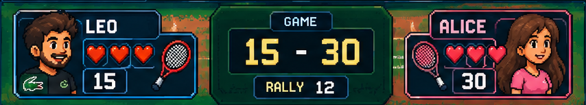
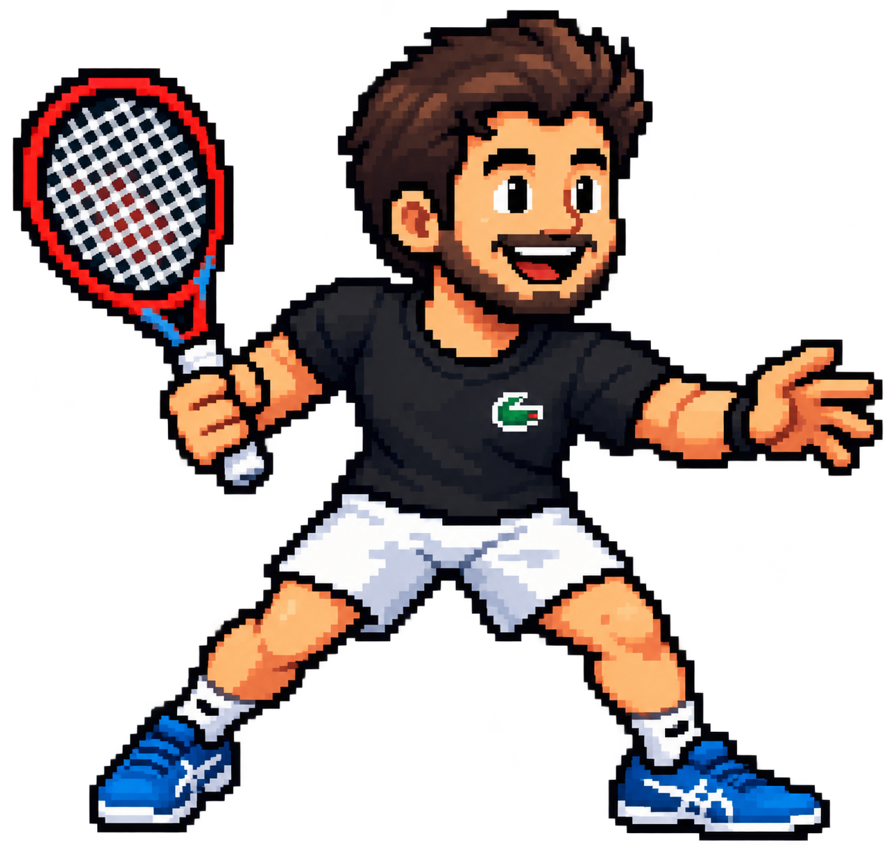
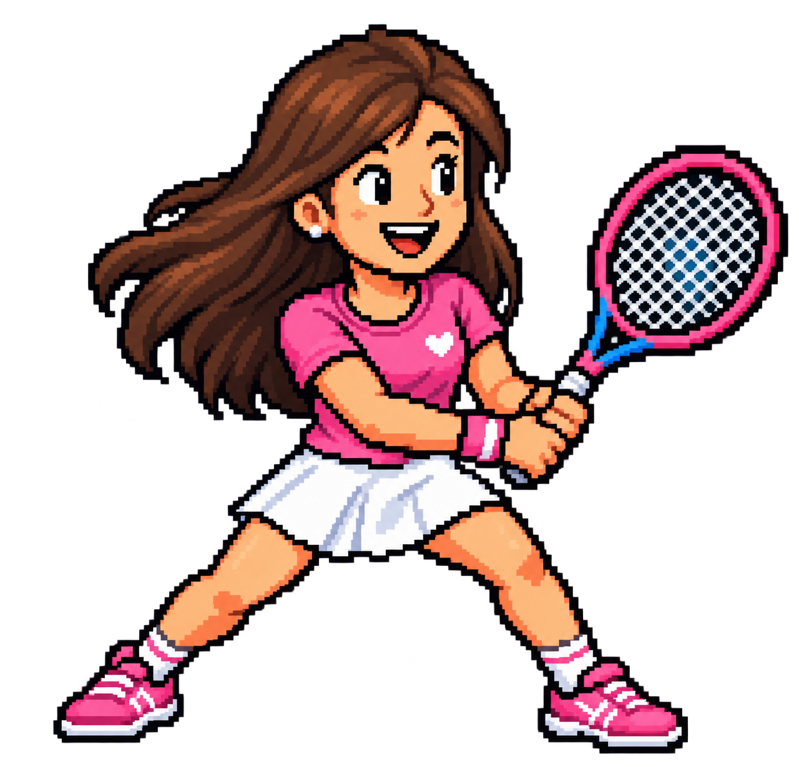
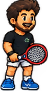
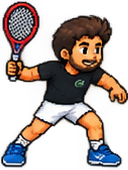
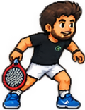
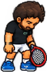
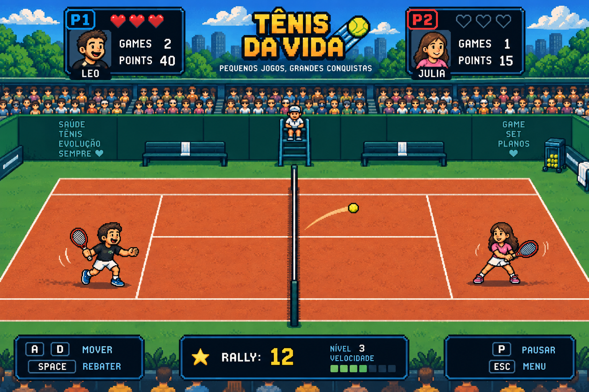

# 🎾 TÊNIS DA VIDA

Um jogo de tênis 2D em pixel art, construído do zero com **TypeScript** e **Canvas** — física arcade, rally jogável, saque manual com timing, adversária controlada por uma IA determinística, e pontuação inspirada no tênis real. Todo o núcleo de simulação é independente de renderização e coberto por testes automatizados.


---

## 🖼️ O jogo por dentro

### Quadra

A quadra e o cenário são construídos a partir de arte real (grama, saibro, arquibancada, juiz), com as marcações (linhas de simples, duplas, saque) desenhadas programaticamente a partir de uma única fonte de geometria — não fazem parte da imagem de fundo.


### Gameplay

<table>
<tr>
<td></td>
<td></td>
</tr>
<tr>
<td align="center">Posição inicial, pronto para o saque</td>
<td align="center">Rally real em andamento</td>
</tr>
</table>

### HUD

O painel de placar/feedback abaixo da quadra mostra nome, corações (sets), games, pontos e a qualidade do último golpe (PERFECT / GOOD / MISS / SAQUE) de cada jogador, além do contador de rally. A arte abaixo é o conceito original do painel de interface — os avatares dela são os únicos elementos reaproveitados no HUD final, que hoje é montado em CSS com os dados reais da partida (a arte completa do painel tinha números de exemplo embutidos que não davam para substituir de forma confiável — detalhes em `docs/PROGRESS.md`).



### Personagens

<table>
<tr>
<td></td>
<td></td>
</tr>
<tr>
<td align="center">Leo — controlado pelo jogador</td>
<td align="center">Alice — adversária, controlada pela CPU</td>
</tr>
</table>

### Sprite sheets

Os personagens foram fatiados a partir de sprite sheets reais — cada frame usado no jogo foi recortado com bounding box exata por canal alfa, documentado em `FRAME_MAP.md` dentro de cada pasta `derived/`.

<table>
<tr>
<td></td>
<td></td>
</tr>
</table>

### Animações

Cada personagem é uma pequena máquina de estados de apresentação (`idle → prepare → contact → recover → miss`), sincronizada a eventos reais do jogo — não é um timer decorativo. Exemplo com os frames reais do Leo:

<table>
<tr>
<td></td>
<td></td>
<td></td>
<td></td>
</tr>
<tr>
<td align="center">idle</td>
<td align="center">prepare</td>
<td align="center">contact</td>
<td align="center">miss</td>
</tr>
</table>

A Alice usa o mesmo padrão, com um detalhe a mais: ela tem sequências completas de **forehand e backhand**, escolhidas em tempo real dependendo de que lado a bola chega.

---

## 🎨 Conceito visual

Antes da câmera lateral (rede na vertical) usada no jogo final, o projeto passou por uma fase de referência visual com uma câmera tradicional de tênis. A imagem abaixo é arte de conceito dessa fase — não é uma captura do jogo final.



---

## 🎮 Como jogar

| Tecla | Ação |
|---|---|
| `A` / `D` | Mover lateralmente |
| `SPACE` | Sacar / Rebater |

**Saque do Leo** é um gesto em dois tempos:

```text
SPACE  →  inicia o toss (a bola sobe)
SPACE  →  realiza o contato (timing decide PERFECT / GOOD / falta)
```

Segurar `A` ou `D` no momento do contato direciona o saque. Depois disso, o rally é só reação:

```text
Alice devolve → Leo rebate → Alice devolve → ...
```

A Alice saca sozinha quando é a vez dela — sem depender de teclado.

---

## ✨ Funcionalidades

- Quadra de tênis em pixel art, com geometria real (simples, duplas, linhas de saque)
- Saque manual do Leo, com toss, janela de timing e mira lateral
- Saque automático e determinístico da Alice
- Rally jogável, com detecção de rebatida por posição, altura e timing
- Física arcade de projétil (gravidade, arco, quique) — compartilhada entre saque e rally
- IA adversária determinística, com previsão de trajetória e erro por dificuldade
- Pontuação tradicional de tênis (0/15/30/40, deuce/vantagem, games, sets) com alternância correta de servidor e de lado de saque
- Sistema de feedback PERFECT / GOOD / MISS por golpe
- Animações de personagem sincronizadas a eventos reais do jogo
- HUD com placar, corações de sets e contador de rally ao vivo

---

## 🧠 Engenharia por trás do jogo

### Game Loop

```text
requestAnimationFrame
      ↓
delta time (dt)
      ↓
input
      ↓
game state (engine.update)
      ↓
physics / collision / IA
      ↓
render (Canvas + HUD)
```

O `dt` é sempre limitado a um intervalo seguro antes de chegar em qualquer outro sistema — isso não é só estilo, é resposta direta a um bug real (ver "🐛 Problemas encontrados durante o desenvolvimento" mais abaixo).

### State Machine

```text
READY_TO_SERVE
      ↓
TOSS
      ↓
RALLY
      ↓
GAME_OVER
```

Cada fase da partida é um estado explícito — não existe um caminho de código onde o toss é interpretado como ponto, ou onde o rally começa sem um saque válido.

### Ownership da bola

A bola sempre pertence a exatamente um lado:

```text
Leo → Alice
Alice → Leo
```

Esse único campo (`ball.owner`) é o que decide quem pode tentar a próxima rebatida — todo o resto (colisão, pontuação, fim de rally) deriva dele.

### Física

O saque **não tem uma física própria** — o toss usa o mesmo integrador de gravidade de qualquer bola em jogo, e o contato do saque chama exatamente a mesma função que lança qualquer golpe de rally. Isso evita duas fontes de verdade para o mesmo comportamento.

### Collision / Hit Detection

Uma tentativa de rebatida só é válida quando a bola está dentro de uma janela de distância, altura e lado da quadra ao mesmo tempo — não basta apertar a tecla no momento certo, é preciso também estar na posição certa.

### IA

A Alice **não usa machine learning**. É uma CPU determinística: prevê onde a bola vai cruzar a posição dela por extrapolação linear da trajetória, e aplica um erro de posição/execução calibrado por dificuldade. É uma decisão técnica deliberada, não uma limitação.

---

## 🧪 Qualidade e testes

```text
148 testes automatizados (Vitest)
TypeScript em modo estrito
ESLint
Build de produção (Next.js)
```

Os testes cobrem, entre outras áreas: estado da partida, saque (Leo e Alice), rally, rebatida, física, pontuação, geometria da quadra, IA da Alice, animação, input de teclado e regressões de bugs históricos.

---

## 🛠️ Evolução do projeto

```text
01 — Geometria da quadra
02 — Limites de movimento e correção da Alice
03 — Redesenho visual da quadra
04 — Animação dos personagens
05 — Mecânica de saque
06 — Correção de saque/rally/input (playtesting real)
07 — Auditoria final e preparação de release
```

Histórico completo, incluindo o que foi tentado e não funcionou, em [`docs/PROGRESS.md`](docs/PROGRESS.md).

---

## 💡 Decisões interessantes

- **Física compartilhada entre saque e rally** — nenhum sistema paralelo, o saque é só uma configuração inicial da mesma simulação.
- **Estado do jogo independente do React** — `game/` nunca importa React; os componentes só leem um snapshot e chamam `update()`.
- **Input discreto, não tecla continuamente pressionada** — uma pressão física gera no máximo uma ação, mesmo com repetição do sistema operacional.
- **Geometria da quadra centralizada** — todas as linhas e limites jogáveis vêm de um único módulo, nunca de números soltos espalhados pelo código.
- **Testes de regressão nomeados para bugs reais** — cada bug encontrado por playtesting virou um teste que impede a volta dele, não só uma correção silenciosa.

---

## 🐛 Problemas encontrados durante o desenvolvimento

**Delta time negativo** — o primeiro frame do `requestAnimationFrame` podia, ocasionalmente, gerar um `dt` negativo e interromper a renderização logo no início da partida.

**Key repeat** — seg segurar `SPACE` um pouco além do limiar de repetição do sistema operacional gerava múltiplas tentativas de saque/rebatida a partir de uma única pressão física.

**Scroll do navegador** — `SPACE` não estava suprimindo o comportamento padrão do navegador, então a página rolava durante o jogo.

**Rebatida no rally** — combinado com o bug de key repeat, uma tentativa de rebatida podia ser consumida antes da bola estar de fato no alcance, fazendo a rebatida "real" (quando a bola já estava perto) não registrar nada.

Todos foram encontrados através de teste manual real no navegador — não só testes automatizados — e cada um recebeu um teste de regressão dedicado depois de corrigido.

---

## Estrutura do projeto

```text
app/          # rota Next.js (App Router)
components/   # React + Canvas: render, HUD, menus, animação
game/         # núcleo de simulação — TypeScript puro, sem React/DOM
public/       # assets de pixel art
docs/         # GAME_DESIGN.md, PROGRESS.md, referências e screenshots
tests/        # 148 testes automatizados
```

---

## ⚙️ Stack

- TypeScript
- Next.js
- React
- HTML Canvas
- Tailwind CSS
- Vitest
- ESLint

---

## 🚀 Executando localmente

```bash
npm install
npm run dev
```

Abra `http://localhost:3000`.

```bash
npm test
npm run typecheck
npm run lint
npm run build
```

---

## 📌 Limitações atuais

- Sem segundo saque / let — uma tentativa de saque por ponto, por decisão de escopo.
- Sem colisão específica com a rede — nem no saque, nem no rally.
- Controles apenas de teclado — sem suporte a mobile/touch.
- Sem persistência entre sessões, sem seletor de dificuldade na interface.

---

## Assets e licença

A arte em `public/assets/` foi gerada com IA para este projeto. Parte dela reproduz marcas reais de terceiros — isso foi mantido por decisão consciente de escopo visual, não é licenciamento verificado. Uma licença para o código ainda não foi definida.
